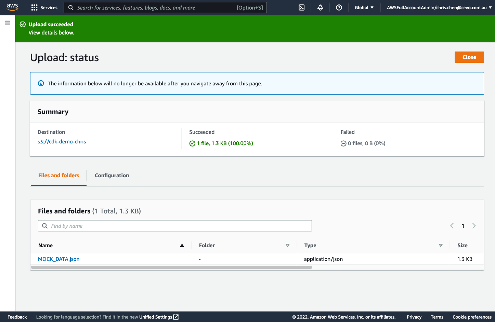
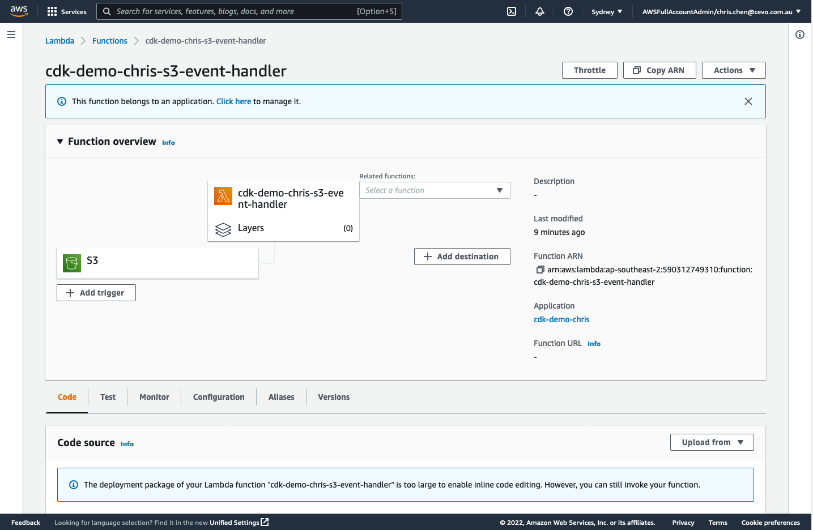
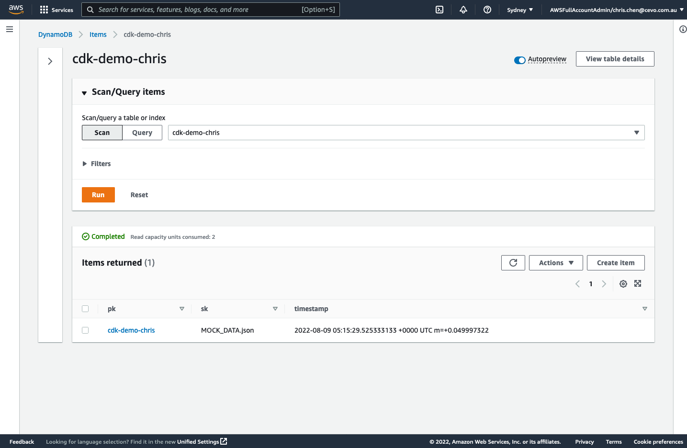

# CDK 2 in Go brown-bag demo

This is a CDK 2 project in Go. I used it in one brown-bag session to introduce CDK to an engineering organisation.

## talk slides
[presentation slides](./slides.pdf)

## companion blog
[Using CDK with Go - a recent brown bag talk and some thoughts](https://www.capturedlabs.com/using-cdk-with-go-a-recent-brown-bag-talk-and-some-thoughts)

## Useful commands

 * `cdk deploy`      deploy this stack to your default AWS account/region
 * `cdk diff`        compare deployed stack with current state
 * `cdk synth`       emits the synthesized CloudFormation template
 * `go test`         run unit tests

## Build it from scratch

- requires node.js
- install CDK globally: `npm i -g cdk` or use `npx cdk ...`
- we use CDK 2: `cdk --version`
- `mkdir project-name && cd project-name`
- init CDK project in Go: `npx cdk init --language go`
- evaluate `cdk.json`
- default deployment: `npx cdk deploy`
- refine CloudFormation stack properties: name, tags
- define s3 bucket
- refine s3 bucket properties: encryption, bucket policy
- define lambda function
- define S3 event source to invoke lambda function
- define DynamoDB table
- grant lambda function permissions to access S3 bucket and DynamoDB table

## Test deployment
- upload a file to the provisioned S3 bucket

- Lambda function should be invoked

- Lambda should write the meta data in the DynamoDB table
